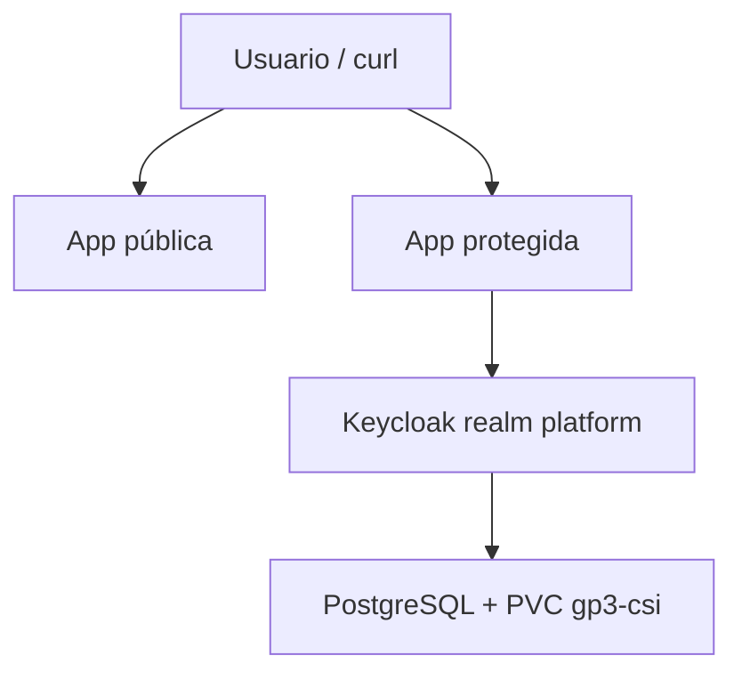

# OpenShift Keycloak POC

Prueba de concepto reproducible de Keycloak 26.7.0 sobre OpenShift 4.18. La POC instala
Keycloak con PostgreSQL persistente, crea el realm `platform` y compara dos versiones de una
misma aplicación: una pública y otra protegida mediante OpenID Connect.

## Estado

| Componente | Estado validado |
|---|---|
| OpenShift | 4.18.48 / Kubernetes 1.31.14 |
| Plataforma | AWS |
| StorageClass | `gp3-csi` |
| Keycloak Operator | 26.7.0, canal `fast`, aprobación manual |
| PostgreSQL | 15.18, PVC de 5 GiB |
| Keycloak | Pod listo y Route TLS edge |
| Realm `platform` | Importado; discovery OIDC responde `HTTP 200` |
| Aplicación pública | Validada: acceso anónimo `HTTP 200` |
| Aplicación protegida | Validada con OAuth2 Proxy 7.15.2 |
| Matriz automática | `6 PASS / 0 FAIL` |

> El dominio de Red Hat Demo Platform es temporal. No se guardan credenciales ni secretos en Git.

## Arquitectura



## Estructura

```text
.
├── apps/
│   ├── backend/app.py
│   ├── manifests/apps.yaml.tpl
│   └── README.md
├── config/
│   └── lab.env.example
├── docs/
│   └── poc-test-plan.md
├── manifests/
│   ├── 00-keycloak-operator.yaml
│   ├── 20-keycloak.yaml.tpl
│   └── 30-platform-realm.yaml
├── scripts/
│   ├── 00-inventory.sh
│   ├── 10-install-operator.sh
│   ├── 20-install-postgresql.sh
│   ├── 30-install-keycloak.sh
│   ├── 40-import-realm.sh
│   ├── 50-configure-poc.sh
│   ├── 60-deploy-apps.sh
│   ├── 70-test-poc.sh
│   └── validate-platform.sh
└── README.md
```

## Requisitos

- OpenShift 4.18.
- Usuario con permisos `cluster-admin`.
- `oc`, `jq` y `envsubst`.
- Catálogos `community-operators` y `redhat-operators`.
- StorageClass dinámica.

## 1. Clonar y configurar

```bash
git clone https://github.com/rubenito77/openshift-keycloak-poc.git
cd openshift-keycloak-poc
chmod +x scripts/*.sh
cp config/lab.env.example config/lab.env
set -a
source config/lab.env
set +a
```

## 2. Inventario

```bash
./scripts/00-inventory.sh
```

La POC fue validada inicialmente contra:

```text
API:    https://api.cluster-bnj5s.bnj5s.sandbox3237.opentlc.com:6443
Apps:   apps.cluster-bnj5s.bnj5s.sandbox3237.opentlc.com
OCP:    4.18.48
```

## 3. Instalar el Operator

```bash
./scripts/10-install-operator.sh
```

La Subscription usa aprobación manual para evitar upgrades inesperados. Revisar:

```bash
oc get subscription.operators.coreos.com -n keycloak
oc get installplan.operators.coreos.com -n keycloak
```

Aprobar el InstallPlan seleccionado:

```bash
INSTALL_PLAN="$(oc get subscription.operators.coreos.com keycloak-operator \
  -n keycloak -o jsonpath='{.status.installPlanRef.name}')"

oc patch installplan.operators.coreos.com "${INSTALL_PLAN}" \
  -n keycloak --type merge -p '{"spec":{"approved":true}}'
```

Verificar:

```bash
oc wait --for=jsonpath='{.status.phase}'=Succeeded \
  csv/keycloak-operator.v26.7.0 -n keycloak --timeout=300s
```

## 4. Instalar PostgreSQL

```bash
./scripts/20-install-postgresql.sh
```

La plantilla genera automáticamente la contraseña y la almacena en
`secret/keycloak-postgresql`. No se debe decodificar ni subir a Git.

```bash
oc get pvc keycloak-postgresql -n keycloak
POSTGRES_POD="$(oc get pods -n keycloak -l name=keycloak-postgresql \
  -o jsonpath='{.items[0].metadata.name}')"
oc exec -n keycloak "${POSTGRES_POD}" -- pg_isready -U keycloak -d keycloak
```

## 5. Instalar Keycloak

```bash
./scripts/30-install-keycloak.sh
```

Verificar:

```bash
oc get keycloak,pods,service,ingress,route -n keycloak
curl -sS -o /dev/null -w 'HTTP %{http_code}\n' \
  "https://${KEYCLOAK_HOST}/"
```

`HTTP 302` en `/` es correcto. El discovery debe responder `HTTP 200`:

```bash
curl -fsS \
  "https://${KEYCLOAK_HOST}/realms/master/.well-known/openid-configuration" |
jq '{issuer,authorization_endpoint,token_endpoint,jwks_uri}'
```

## 6. Importar el realm

```bash
./scripts/40-import-realm.sh
```

El realm contiene:

- roles `platform-admin`, `platform-operator` y `platform-user`;
- grupos equivalentes;
- protección contra fuerza bruta;
- auditoría de eventos;
- registro público deshabilitado.

Validar:

```bash
curl -fsS \
  "https://${KEYCLOAK_HOST}/realms/platform/.well-known/openid-configuration" |
jq '{issuer,authorization_endpoint,token_endpoint,userinfo_endpoint,jwks_uri}'
```

Después de comprobar la importación:

```bash
oc delete keycloakrealmimport platform-realm -n keycloak
```

Esto limpia el Job temporal y no elimina el realm importado.

## 7. Validación integral

```bash
./scripts/validate-platform.sh
```

## 8. Configurar el cliente y usuarios de la POC

```bash
./scripts/50-configure-poc.sh
```

El script crea:

- cliente confidencial `app-protected`;
- redirect URI exacta de OAuth2 Proxy;
- audience mapper;
- usuario `poc-authorized` con `platform-user`;
- usuario `poc-denied` sin el rol;
- Secrets `app-protected-oidc` y `poc-test-users`.

Las credenciales se generan aleatoriamente y nunca se imprimen ni se almacenan en Git.

> Para automatizar los casos positivos y negativos se habilita Direct Access Grants.
> Esta opción es exclusiva de la POC y debe deshabilitarse en producción.

## 9. Desplegar ambas aplicaciones

```bash
./scripts/60-deploy-apps.sh
```

Verificar:

```bash
oc get deployment,pods,service,route -n keycloak-poc-apps
```

Abrir:

```text
https://app-public.${APPS_DOMAIN}
https://app-protected.${APPS_DOMAIN}
```

## 10. Escenario comparativo de aplicaciones

La siguiente fase despliega el mismo backend en dos variantes:

| Flujo | Sin autenticación | Con autenticación |
|---|---|---|
| `app-public` | `HTTP 200` directo | No aplica |
| `app-protected` | `HTTP 302` hacia Keycloak | `HTTP 200` después del login |

Además se demostrarán:

- credenciales inválidas;
- usuario autenticado sin rol: `HTTP 403`;
- usuario con `platform-user`: acceso permitido;
- logout y nueva redirección a Keycloak;
- validación del issuer, firma, roles y expiración del token.

La matriz completa está en [docs/poc-test-plan.md](docs/poc-test-plan.md).

La guía para convertir una aplicación pública en privada está en
[docs/public-to-private-keycloak.md](docs/public-to-private-keycloak.md).

Ejecutar las comprobaciones:

```bash
./scripts/70-test-poc.sh
```

Resultado esperado:

```text
PASS PUB-01   HTTP 200
PASS PRO-01   HTTP 302
PASS PRO-03   HTTP 400
PASS PRO-05   HTTP 200
PASS PRO-04   HTTP 403
PASS TOK-01   issuer correcto

Resultado: 6 PASS / 0 FAIL
```

## 11. Pruebas visuales en navegador

### 11.1 Aplicación pública

Abrir:

```text
https://${PUBLIC_HOST}/
```

No debe solicitar login. La página debe mostrar:

```text
variant: public
authenticated: false
user: anonymous
```

Validación JSON:

```bash
curl -sS "https://${PUBLIC_HOST}/api/whoami" | jq
```

### 11.2 Aplicación protegida con usuario autorizado

Obtener las credenciales sólo en la terminal local:

```bash
AUTHORIZED_USER="$(
  oc get secret poc-test-users -n keycloak-poc-apps \
    -o jsonpath='{.data.authorized-username}' | base64 -d
)"
AUTHORIZED_PASSWORD="$(
  oc get secret poc-test-users -n keycloak-poc-apps \
    -o jsonpath='{.data.authorized-password}' | base64 -d
)"
printf 'Usuario: %s\n' "${AUTHORIZED_USER}"
printf 'Password: %s\n' "${AUTHORIZED_PASSWORD}"
```

Abrir una ventana privada y acceder a:

```text
https://${PROTECTED_HOST}/
```

Keycloak debe solicitar login en el realm `platform`. Después de ingresar con
`poc-authorized`, la aplicación debe mostrar:

```text
variant: protected
authenticated: true
user: poc-authorized
email: poc-authorized@example.com
access_token_forwarded: true
```

### 11.3 Usuario autenticado sin autorización

Cerrar la ventana privada anterior y abrir otra nueva. Obtener las credenciales:

```bash
DENIED_USER="$(
  oc get secret poc-test-users -n keycloak-poc-apps \
    -o jsonpath='{.data.denied-username}' | base64 -d
)"
DENIED_PASSWORD="$(
  oc get secret poc-test-users -n keycloak-poc-apps \
    -o jsonpath='{.data.denied-password}' | base64 -d
)"
printf 'Usuario: %s\n' "${DENIED_USER}"
printf 'Password: %s\n' "${DENIED_PASSWORD}"
```

Ingresar en la aplicación protegida con `poc-denied`. Keycloak debe autenticar al
usuario, pero OAuth2 Proxy debe responder:

```text
403 Forbidden
```

Esto demuestra que autenticación y autorización son controles diferentes:

- Keycloak confirma la identidad.
- OAuth2 Proxy exige el rol `platform-user`.

Limpiar las variables:

```bash
unset AUTHORIZED_USER AUTHORIZED_PASSWORD
unset DENIED_USER DENIED_PASSWORD
```

## Seguridad

- No versionar `config/lab.env`.
- No almacenar contraseñas, tokens o client secrets.
- Mantener aprobación manual del Operator.
- Cambiar el administrador inicial y habilitar MFA fuera de una POC.
- PostgreSQL es una instancia única de laboratorio, no una topología HA.
- Las CR experimentales de clientes OIDC se evaluarán por separado.

## Próximas fases

1. Ejecutar las aplicaciones en el laboratorio OpenShift.
2. Validar login y logout desde navegador.
3. Guardar evidencias no sensibles.
4. Agregar uninstall y backup/restore.
