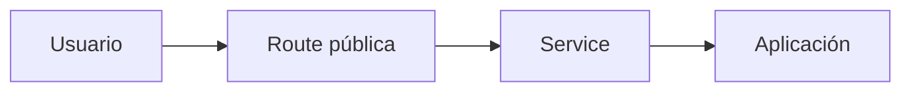
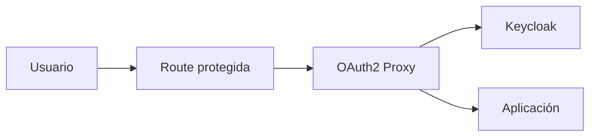

# De aplicación pública a aplicación protegida por Keycloak

Esta guía explica cómo convertir una aplicación accesible anónimamente en una aplicación
privada que autentica usuarios con Keycloak y autoriza el acceso mediante roles.

La implementación de esta POC utiliza OAuth2 Proxy como capa de seguridad delante de la
aplicación. El backend no necesita implementar directamente OpenID Connect.

## 1. Arquitectura

### Antes



Cualquier cliente que conozca la URL puede llegar al backend.

### Después



La Route ya no apunta directamente al puerto del backend. Apunta a OAuth2 Proxy, que:

1. comprueba si existe una sesión válida;
2. redirige al usuario a Keycloak si no está autenticado;
3. valida tokens, issuer, audiencia y firma;
4. verifica el rol requerido;
5. permite o rechaza el acceso;
6. propaga al backend cabeceras de identidad no sensibles.

## 2. Dos estrategias posibles

| Estrategia | Uso recomendado | Impacto en la aplicación |
|---|---|---|
| OAuth2 Proxy delante de la app | Aplicaciones legacy, estáticas o sin soporte OIDC | Bajo |
| OIDC implementado en la app | Aplicaciones nuevas con control fino de sesión y autorización | Medio/alto |

Esta POC usa OAuth2 Proxy porque permite demostrar el cambio sin modificar la lógica del
backend. Para una aplicación nueva puede ser preferible integrar una librería OIDC nativa.

## 3. Requisitos previos

- Keycloak accesible mediante HTTPS.
- Realm de aplicación, por ejemplo `platform`.
- Cliente OIDC confidencial.
- Route HTTPS de la aplicación.
- Secret para el cliente OIDC.
- Roles o grupos que representen permisos.
- OAuth2 Proxy compatible con el provider `keycloak-oidc`.

## 4. Configuración en Keycloak

### 4.1 Crear el cliente OIDC

Configuración usada por la POC:

```text
Realm:                 platform
Client ID:             app-protected
Client authentication: On
Standard flow:         On
Direct access grants:  On sólo para pruebas automatizadas
```

Para un entorno productivo, `Direct access grants` debe permanecer deshabilitado salvo que
exista un requisito explícito y evaluado.

### 4.2 Definir una Redirect URI exacta

```text
https://app-protected.<apps-domain>/oauth2/callback
```

Evitar patrones amplios como:

```text
https://*.example.com/*
```

Una Redirect URI demasiado permisiva puede permitir redirecciones no deseadas.

### 4.3 Configurar Web Origin

```text
https://app-protected.<apps-domain>
```

No usar `*` en producción.

### 4.4 Configurar audiencia

OAuth2 Proxy debe aparecer como audiencia válida del token:

```text
Audience: app-protected
Add to ID token: true
Add to access token: true
```

En la POC se crea un audience mapper llamado `audience-app-protected`.

### 4.5 Crear el rol

```text
Realm role: platform-user
```

Los usuarios autorizados reciben el rol directamente o mediante un grupo. Los usuarios
autenticados sin ese rol deben obtener `HTTP 403`.

## 5. Secret de OpenShift

OAuth2 Proxy requiere:

```yaml
apiVersion: v1
kind: Secret
metadata:
  name: app-protected-oidc
type: Opaque
stringData:
  client-id: app-protected
  client-secret: REEMPLAZAR
  cookie-secret: REEMPLAZAR
```

No versionar los valores reales. Crear o sincronizar el Secret desde un gestor de secretos,
un pipeline seguro o un comando local.

En esta POC `scripts/50-configure-poc.sh` genera ambos secretos aleatoriamente.

## 6. Cambios en OpenShift

### 6.1 Aplicación pública

```text
Route → Service:8080 → backend:8080
```

### 6.2 Aplicación protegida

```text
Route → Service:4180 → OAuth2 Proxy:4180 → 127.0.0.1:8080
```

El backend protegido escucha en `127.0.0.1`. Por lo tanto, sólo OAuth2 Proxy, dentro del
mismo pod, puede acceder directamente.

### 6.3 Configuración esencial de OAuth2 Proxy

```text
--provider=keycloak-oidc
--oidc-issuer-url=https://<keycloak-host>/realms/platform
--redirect-url=https://<app-host>/oauth2/callback
--upstream=http://127.0.0.1:8080/
--http-address=0.0.0.0:4180
--allowed-role=platform-user
--code-challenge-method=S256
--reverse-proxy=true
--cookie-secure=true
--cookie-samesite=lax
```

Los valores `client-id`, `client-secret` y `cookie-secret` se inyectan desde el Secret.

El manifiesto completo está en:

```text
apps/manifests/apps.yaml.tpl
```

## 7. Cabeceras hacia el backend

Después de autenticar al usuario, OAuth2 Proxy puede propagar:

```text
X-Forwarded-User
X-Forwarded-Email
X-Forwarded-Preferred-Username
X-Forwarded-Access-Token
```

El backend no debe confiar en estas cabeceras si puede ser invocado evitando OAuth2 Proxy.
Por eso la POC:

- expone únicamente el puerto de OAuth2 Proxy mediante el Service;
- mantiene el backend protegido en loopback;
- no crea una Route directa al backend protegido.

No imprimir access tokens en logs o páginas.

## 8. Plan de migración

### Fase 1 — Línea base

1. Registrar URL, Route, Service y puerto actuales.
2. Confirmar `HTTP 200` anónimo.
3. Identificar health checks, callbacks y endpoints que deban seguir públicos.
4. Definir usuarios, grupos y roles autorizados.

### Fase 2 — Keycloak

1. Crear realm o seleccionar uno existente.
2. Crear cliente confidencial.
3. Configurar redirect URI exacta.
4. Configurar audience mapper.
5. Crear rol y asignaciones.
6. Crear el Secret OIDC en OpenShift.

### Fase 3 — Capa de protección

1. Incorporar OAuth2 Proxy como sidecar o Deployment separado.
2. Cambiar el Service para apuntar a OAuth2 Proxy.
3. Restringir acceso directo al backend.
4. Crear una Route temporal para pruebas.
5. Validar login, callback, roles y logout.

### Fase 4 — Cutover

1. Mantener la Route pública sin cambios mientras se prueba la protegida.
2. Validar usuarios autorizados y denegados.
3. Cambiar la Route oficial para que apunte al proxy.
4. Supervisar errores `4xx`, callbacks y latencia.
5. Retirar el acceso directo sólo después de la validación.

## 9. Pruebas mínimas

| Caso | Resultado esperado |
|---|---|
| App pública sin sesión | `HTTP 200` |
| App protegida sin sesión | `HTTP 302` hacia Keycloak |
| Contraseña incorrecta | `HTTP 400 invalid_grant` en la prueba de token |
| Usuario con rol | `HTTP 200` |
| Usuario autenticado sin rol | `HTTP 403` |
| Issuer incorrecto | Token rechazado |
| Redirect URI no registrada | Login rechazado |
| Token expirado | Acceso rechazado |

En la POC:

```bash
./scripts/70-test-poc.sh
```

## 10. Rollback

El rollback debe estar preparado antes del cutover:

1. conservar temporalmente el Service/Route públicos anteriores;
2. guardar los manifiestos previos;
3. restaurar la Route hacia el puerto del backend;
4. verificar `HTTP 200`;
5. revisar sesiones y cambios realizados durante la ventana;
6. no eliminar inmediatamente el cliente OIDC, para conservar evidencia y facilitar análisis.

El rollback recupera disponibilidad, pero vuelve a exponer la aplicación sin autenticación.
Debe tratarse como una medida temporal.

## 11. Producción

Antes de adoptar el patrón fuera de una POC:

- deshabilitar Direct Access Grants;
- usar PostgreSQL administrado o con alta disponibilidad;
- ejecutar más de una réplica cuando el patrón de sesiones lo permita;
- usar almacenamiento de sesiones compartido si se requiere;
- aplicar NetworkPolicies;
- usar TLS reencrypt si se requiere cifrado hasta el pod;
- rotar client secrets;
- integrar External Secrets o Vault;
- habilitar MFA para cuentas privilegiadas;
- restringir redirect URIs y web origins;
- configurar límites, probes, PodDisruptionBudget y anti-affinity;
- monitorizar errores OIDC, latencia, `401`, `403` y disponibilidad;
- no confiar en cabeceras reenviadas desde rutas alternativas;
- respaldar y probar la recuperación de la base de Keycloak.

## 12. Integración OIDC nativa

Si la aplicación implementa OIDC directamente, debe:

1. descubrir endpoints mediante `/.well-known/openid-configuration`;
2. usar Authorization Code Flow con PKCE;
3. validar `iss`, `aud`, firma, `exp`, `nbf` y `state`;
4. proteger contra CSRF y replay;
5. gestionar sesiones y renovación de tokens;
6. implementar logout;
7. convertir roles o claims en permisos internos;
8. no almacenar tokens en logs ni URLs;
9. validar certificados TLS;
10. definir comportamiento ante indisponibilidad del proveedor de identidad.

La integración nativa ofrece mayor control, pero también transfiere más responsabilidad de
seguridad al equipo de la aplicación.

